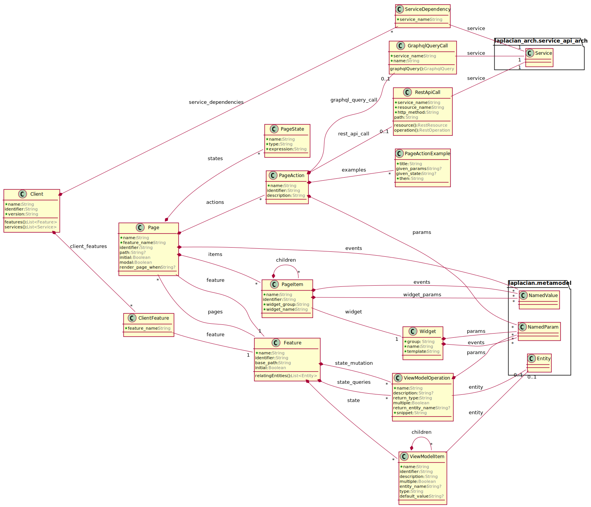

## Description of entities

### Structure

---
### **page** (*laplacian_arch.client_app_arch.model.Page*)
  A page of this application.

#### Properties
* **name:** `String`
  The name of this page.
* **feature_name:** `String`
  The feature_name of this page.
* **identifier:** `String?`
  The identifier of this page.
* **path:** `String?`
  The path of this page.
* **initial:** `Boolean?`
  Whether this page is the default entry point of the feature.
* **modal:** `Boolean?`
  Whether this page is shown in a modal window.
* **render_page_when:** `String?`
  The condition which must be satisfied before rendering the content of this page.

#### Relationships
* **feature:** `Feature`
  The feature containing this page.
* **items:** `List<PageItem>`
  The list of UI items this page consists of.
* **actions:** `List<PageAction>`
  The list of handlers which is called when a certain event in this page happens.
* **states:** `List<PageState>`
  A subset of the client side application state that relevant to the function of this page.
* **events:** `List<NamedValue>`
  The list of event which may happen in this page.

---
### **page_item** (*laplacian_arch.client_app_arch.model.PageItem*)
  A page item represents a (sometimes potentially) visible UI component in the page.

#### Properties
* **name:** `String`
  名称
* **identifier:** `String?`
  識別子
* **widget_group:** `String`
  The widget_group of this page_item.
* **widget_name:** `String`
  The widget_name of this page_item.

#### Relationships
* **page:** `Page?`
  The page this item belongs to. (It is null when this item is not a top-level item)
* **widget:** `Widget`
  widget
* **widget_params:** `List<NamedValue>`
  widget_params
* **events:** `List<NamedValue>`
  events
* **children:** `List<PageItem>`
  The list of items this item contains.
* **parent:** `PageItem?`
  The item which contains this one. (It is null when this item is a top-level item)

---
### **page_action** (*laplacian_arch.client_app_arch.model.PageAction*)
  An page action is the handler which is called when a certain event happens in this page.

#### Properties
* **name:** `String`
  The name of this page_action.
* **identifier:** `String?`
  The identifier of this page_action.
* **description:** `String?`
  The description of this page_action.

#### Relationships
* **page:** `Page`
  page
* **params:** `List<NamedParam>`
  params
* **rest_api_call:** `RestApiCall?`
  rest_api_call
* **graphql_query_call:** `GraphqlQueryCall?`
  graphql_query_call
* **examples:** `List<PageActionExample>`
  examples

---
### **page_state** (*laplacian_arch.client_app_arch.model.PageState*)
  page_state

#### Properties
* **name:** `String`
  The name of this page_state.
* **type:** `String`
  The type of this page_state.
* **expression:** `String`
  The expression of this page_state.

#### Relationships
* **page:** `Page`
  page

---
### **named_value** (*laplacian.metamodel.model.NamedValue*)
  named_value

#### Properties
* **name:** `String`
  The name of this named_value.
* **expression:** `String`
  The expression of this named_value.

#### Relationships

---
### **client** (*laplacian_arch.client_app_arch.model.Client*)
  client

#### Properties
* **name:** `String`
  The name of this client.
* **identifier:** `String?`
  The identifier of this client.
* **version:** `String`
  The version of this client.

#### Relationships
* **client_features:** `List<ClientFeature>`
  client_features
* **features:** `List<Feature>`
  features
* **service_dependencies:** `List<ServiceDependency>`
  service_dependencies
* **services:** `List<Service>`
  services

---
### **client_feature** (*laplacian_arch.client_app_arch.model.ClientFeature*)
  client_feature

#### Properties
* **feature_name:** `String`
  The feature_name of this client_feature.

#### Relationships
* **client:** `Client`
  client
* **feature:** `Feature`
  feature

---
### **service_dependency** (*laplacian_arch.client_app_arch.model.ServiceDependency*)
  service_dependency

#### Properties
* **service_name:** `String`
  The service_name of this service_dependency.

#### Relationships
* **client:** `Client`
  client
* **service:** `Service`
  service

---
### **widget** (*laplacian_arch.client_app_arch.model.Widget*)
  A widget represents a type of a visible UI component.

#### Properties
* **group:** `String`
  The group of this widget.
* **name:** `String`
  The name of this widget.
* **template:** `String`
  The template string which defines appearance of this widget.

#### Relationships
* **params:** `List<NamedParam>`
  The configurable parameters with whtch the appearance and behavior of this widget can be changed.
* **events:** `List<NamedParam>`
  The events which can be used to hook certain actions.

---
### **named_param** (*laplacian.metamodel.model.NamedParam*)
  named_param

#### Properties
* **name:** `String`
  The name of this named_param.
* **type:** `String`
  The type of this named_param.
* **description:** `String?`
  The description of this named_param.

#### Relationships

---
### **named_param** (*laplacian.metamodel.model.NamedParam*)
  named_param

#### Properties
* **name:** `String`
  The name of this named_param.
* **type:** `String`
  The type of this named_param.
* **description:** `String?`
  The description of this named_param.

#### Relationships

---
### **feature** (*laplacian_arch.client_app_arch.model.Feature*)
  A feature of this application client.

#### Properties
* **name:** `String`
  The name of this feature.
* **identifier:** `String?`
  The identifier of this feature.
* **base_path:** `String?`
  The base_path of this feature.
* **initial:** `Boolean?`
  Whether this feature is the entry point of this application.

#### Relationships
* **pages:** `List<Page>`
  The list of pages the feature contains.
* **state:** `List<ViewModelItem>`
  The data structure of the client side application state concerning thie feature.
* **state_queries:** `List<ViewModelOperation>`
  The queries to the client side application state.
* **state_mutation:** `List<ViewModelOperation>`
  The list of functions which mutate the current client side application state.
* **relating_entities:** `List<Entity>`
  The list of entities this feature refers to

---
### **view_model_item** (*laplacian_arch.client_app_arch.model.ViewModelItem*)
  view_model_item

#### Properties
* **name:** `String`
  The name of this view_model_item.
* **identifier:** `String?`
  The identifier of this view_model_item.
* **description:** `String?`
  The description of this view_model_item.
* **multiple:** `Boolean?`
  define wether this item has multiple values or not
* **entity_name:** `String?`
  The name of the entity which is used as the type of this item. (This property can not be used with the type property.)
* **type:** `String?`
  The type of this view_model_item.
* **default_value:** `String?`
  The default_value of this view_model_item.

#### Relationships
* **entity:** `Entity?`
  The entity which is used as the type of this item. (This can be null if this item has a simple-type.)
* **feature:** `Feature?`
  feature
* **children:** `List<ViewModelItem>`
  children
* **parent:** `ViewModelItem?`
  parent

---
### **view_model_operation** (*laplacian_arch.client_app_arch.model.ViewModelOperation*)
  view_model_operation

#### Properties
* **name:** `String`
  The name of this view_model_operation.
* **description:** `String?`
  The description of this view_model_operation.
* **return_type:** `String?`
  The return_type of this view_model_operation.
* **multiple:** `Boolean?`
  Defines this view_model_operation is multiple or not.
* **return_entity_name:** `String?`
  The return_entity_name of this view_model_operation.
* **snippet:** `String`
  The snippet of this view_model_operation.

#### Relationships
* **feature:** `Feature`
  feature
* **params:** `List<NamedParam>`
  params
* **entity:** `Entity?`
  entity

---
### **view_model_operation** (*laplacian_arch.client_app_arch.model.ViewModelOperation*)
  view_model_operation

#### Properties
* **name:** `String`
  The name of this view_model_operation.
* **description:** `String?`
  The description of this view_model_operation.
* **return_type:** `String?`
  The return_type of this view_model_operation.
* **multiple:** `Boolean?`
  Defines this view_model_operation is multiple or not.
* **return_entity_name:** `String?`
  The return_entity_name of this view_model_operation.
* **snippet:** `String`
  The snippet of this view_model_operation.

#### Relationships
* **feature:** `Feature`
  feature
* **params:** `List<NamedParam>`
  params
* **entity:** `Entity?`
  entity